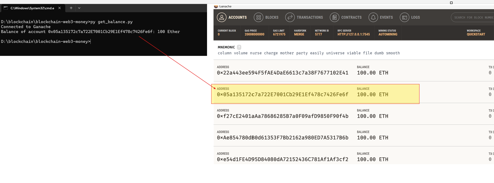

# Blockchain Web3 Python & Ganache

## Blcokchain 
Blockchain adalah teknologi yang memungkinkan pencatatan data secara terdesentralisasi, aman, dan transparan. 
Data dalam blockchain disimpan dalam bentuk "blok" yang saling terhubung (seperti rantai), 
di mana setiap blok berisi sejumlah transaksi. 
Setiap blok baru yang ditambahkan ke blockchain diverifikasi dan disetujui oleh jaringan node yang terdistribusi, 
sehingga membuat data dalam blockchain sulit untuk diubah atau dipalsukan.

Blcokchain dapat digunakan 
1. Keuangan (Fintech): menyimpan saldo asset dan history transaksi 
2. Rantai Pasokan (Supply Chain):Pelacakan produk dari produksi hingga pengiriman ke konsumen
3. Kesehatan : Penyimpanan dan pertukaran data medis
4. Pemungutan Suara (Voting): Mengurangi risiko kecurangan
5. Properti dan Real Estate :Pencatatan kepemilikan aset
6. Manajemen Identitas : Penyimpanan identitas digital

## Web3 Python
Web3.py adalah sebuah library Python yang memungkinkan Anda berinteraksi dengan blockchain Ethereum

## Ganache
Ganache adalah sebuah aplikasi yang memungkinkan Anda untuk memulai jaringan Ethereum pribadi secara lokal
untuk enviroment development dan pengujian 

## Table of Contents
- [1. Upgrade Python Package Manager](#1-upgrade-python-package-manager)
- [2. Install Package Libry Python web3](#2-install-package-libry-python-web3)
- [3. Install Ganache](#3-install-ganache)
- [4. Ganache Dashboard](#4-ganache-dashboard)
- [5. Ganache Check Service Port Running](#5-ganache-check-service-port-running)
- [6. Python Web3 - Check Koneksi ke Ganache](#6-python-web3---check-koneksi-ke-ganache)
- [7. Python Web3 - Check Saldo](#7-python-web3---check-saldo)
- [8. Python Web3 - Transaction](#8-python-web3---transaction)
- [9. Check & Analisa Blok](#9-check--analisa-blok)
  - [9.1 Jumlah Blok bertambah setiap terjadi transaksi, bagian yg di stabilo kuning](#91-jumlah-blok-bertambah-setiap-terjadi-transaksi-bagian-yg-di-stabilo-kuning)
  - [9.2 List Blok yg terbuat dan tersimpan di chain ketika terjadi transaksi](#92-list-blok-yg-terbuat-dan-tersimpan-di-chain-ketika-terjadi-transaksi)
  - [9.3 List Transaction yg merupakan dasar pembuatan block](#93-list-transaction-yg-merupakan-dasar-pembuatan-block)
  - [9.4 Detail blok berisikan data yg sudah di enkripsi dan diberikan sign signature hash](#94-detail-blok-berisikan-data-yg-sudah-di-enkripsi-dan-diberikan-sign-signature-hash)
- [10. Cara Kerja Penyimpan Data di BlockChain](#10-cara-kerja-penyimpan-data-di-blockchain)
- [11. Create Account ](#11-create-account)
- [12. History Account ](#12-history-account)
- [13. List Account](#13-list-account)
- [14. Membuat Server Blockchain on-premise](#11-membuat-server-blockchain-on-premise)
 
 
## 1. Upgrade Python Package Manager 

<pre><code>
 python.exe -m pip install --upgrade --user pip </code></pre>
 

## 2. Install Package Libry Python web3
 
 <pre><code>
 pip install web3 </code></pre>

 
 

## 3. Install Ganache

https://archive.trufflesuite.com/ganache/

## 4. Ganache Dashboard

## 5. Ganache Check Service Port Running 

## 6. Python Web3 - Check Koneksi ke Ganache

 <pre><code>
 python test_connection.py  </code></pre>

## 7. Python Web3 - Check Saldo 

 <pre><code>
 python get_balance.py </code></pre>

## 8. Python Web3 - Transaction

 <pre><code>
 python create_transaction.py </code></pre>

## 9. Check & Analisa Blok 

### 9.1 Jumlah Blok bertambah setiap terjadi transaksi, bagian yg di stabilo kuning 

### 9.2 List Blok yg terbuat dan tersimpan di chain ketika terjadi transaksi 

### 9.3 List Transaction yg merupakan dasar pembuatan block

### 9.4 Detail blok berisikan data yg sudah di enkripsi dan diberikan sign signature hash

## 10. Cara Kerja Penyimpan Data di BlockChain 

Dalam jaringan blockchain, setiap transaksi baru ditambahkan ke blok baru, dan blok tersebut ditambahkan ke blockchain. Proses ini terjadi di seluruh node (server) dalam jaringan yang terdistribusi. Artinya, setiap node (server) dalam jaringan blockchain memiliki salinan lengkap dari seluruh blockchain, termasuk semua transaksi yang pernah terjadi.

Setiap kali transaksi baru dibuat dan dikonfirmasi, transaksi tersebut ditambahkan ke blok terbaru. Setelah blok tersebut berhasil ditambangkan dan ditambahkan ke blockchain, blok ini akan disebarkan ke semua node (server) dalam jaringan. Semua node memperbarui salinan blockchain mereka untuk memasukkan blok baru ini.

Berikut adalah proses umum bagaimana transaksi ditambahkan ke blockchain

1. Transaksi dibuat: Transaksi baru dibuat dan disiarkan ke jaringan.
2. Transaksi disebarkan: Transaksi disebarkan ke semua node dalam jaringan .
3. Transaksi dikumpulkan: Transaksi dikumpulkan oleh para penambang dan dimasukkan ke dalam blok baru.
4. Blok ditambangkan: Penambang mencoba untuk menyelesaikan masalah matematika (proof-of-work) untuk menambang blok baru.
5. Blok ditambahkan ke blockchain: Setelah blok berhasil ditambang, blok tersebut ditambahkan ke blockchain dan disebarkan ke semua node dalam jaringan blockchain.
6. Node memperbarui blockchain: Semua node memperbarui salinan blockchain mereka untuk memasukkan blok baru ini.
7. Jadi, setiap transaksi baru menambah satu entri dalam blok baru dan didistribusikan ke seluruh node dalam jaringan yang terdistribusi. Ini memastikan keamanan dan desentralisasi jaringan blockchain.

## 11. Create Account  

<pre><code>
 python create_account.py </code></pre>

## 12. History Account  

<pre><code>
 python history_account.py </code></pre>

## 13. List Account  

<pre><code>
 python list_account.py </code></pre>

## 14. Membuat Server Blockchain on-premise

Untuk membuat server blockchain on-premises, Anda dapat menggunakan beberapa framework yang populer dan mendukung desentralisasi serta keamanan. Berikut adalah beberapa framework yang bisa Anda pertimbangkan:

1. Hyperledger Fabric:
Hyperledger Fabric adalah platform blockchain yang dirancang untuk bisnis. Ini memungkinkan Anda untuk membuat jaringan permissioned (dengan izin) yang dapat diinstal di lingkungan on-premise.
Hyperledger Fabric mendukung modulitas dan dapat diintegrasikan dengan sistem bisnis yang ada.

2. Ethereum:
Ethereum juga dapat diinstal di lingkungan on-premises. Anda dapat menggunakan Ethereum untuk membuat aplikasi blockchain dan menjalankan smart contracts.
Ethereum memerlukan node yang lebih besar untuk menyimpan dan memproses semua transaksi dalam jaringan.

3. IBM Blockchain Platform:
IBM Blockchain Platform mendukung instalasi di lingkungan on-premises. Anda dapat menggunakan platform ini untuk membangun dan mengelola jaringan blockchain di dalam perangkat keras Anda2.
Platform ini mendukung Kubernetes dan OpenShift untuk pengelolaan cluster blockchain.

4. SettleMint:
SettleMint menawarkan solusi on-premises untuk pengembangan blockchain. Anda dapat menginstal dan menjalankan aplikasi blockchain di infrastruktur Anda sendiri.
SettleMint mendukung berbagai metode instalasi, termasuk air-gapped (tidak terhubung ke internet) dan Bring Your Own Cloud (BYOC)

